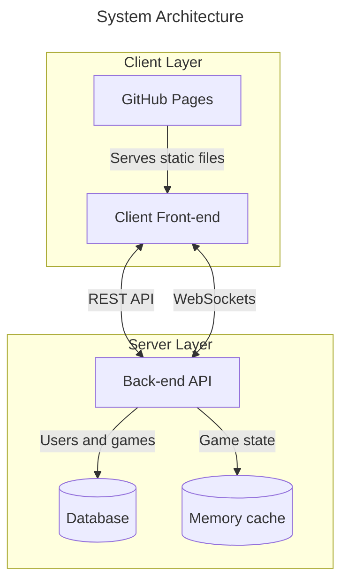

# Stack

## Architecture

## Back-end

I would like to make the back-end on a Rust platform. For fun.
I would like something like Spring or Nest (IOC based)
but it seems I might have to make do with Rocket.
Axum and Actix seem a bit too low level,
and Loco seems too based on the MVC view (and it won't be doing views).

Thus I might have to do it with NestJS,
which might be smart since it's what I'm used to.
Though I wonder about storing stuff in-memory.

If I end up using Rust I'd like to try using SQLx and some SQL solution for migration.

As a database I might wanna use Postgres since it's there and why not.
And as a memory cache I can't see why I wouldn't use Redis.

## Front-end

I think for the front-end I should use
[NextJS's static exports](https://nextjs.org/docs/pages/guides/static-exports).
For the sockets, I could use Socket.IO.
And for the animations, I could use Framer Motion.

## Observability

To be honest, I have no idea because I haven't really used it,
but AI recommends OpenTelemetry, Prometheus, Loki and Tempo aggregating into Grafana.

I want to collect the three pillars of observability:

1. Logs. They register events that have happened, ideally with metadata.
2. Metrics. Numbers that assist in indicating performance over time.
3. Traces. A timestamped journal through each request.

And here is how each app helps:

- OpenTelemetry serves as a framework for generating metrics, logs and traces that other applications can consume.
- Prometheus is a queriable database for metrics.
- Loki is a queriable database for logs.
- Tempo is a queriable database for traces.
- Grafana is a dashboard for all three above.

## Testing

I want to do integration testing and probably E2E testing.
AI recommends k6 for E2E testing - seems viable, we'll see when I get there.
Maybe we can also do Playwright for front-end testing.
It says Artillery is an alternative.

It recommends using testcontainers for testing.
Not the worst idea to be honest, they seem pretty cool,
particularly for testing within CI/CD.
But it may mean I'll have to really compartmentalize testing
and leave it mostly to CI/CD because I can't be bothered
to wait for all that to run...

## Deployment

Docker and Dokku seem pretty good,
however I don't think Dokku will allow me to define the infrastructure as code.
So I think I will be using OpenTofu (a Terraform fork), just to try it out.
